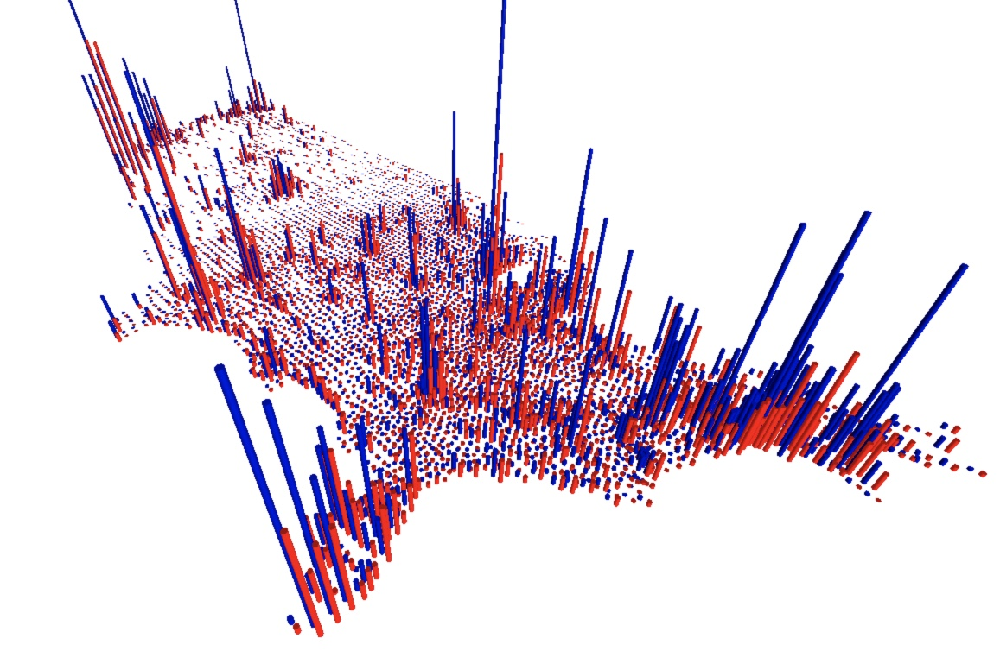

## Overview

A look at the 2016 US presidential election results in 3D.



Live version at https://www.deanspot.org/~alex/2016-election-results/index.html.

## Sources

### election results

  1. Data from https://github.com/tonmcg/County_Level_Election_Results_12-16
  1. I found out about it via https://simonrogers.net/2016/11/16/us-election-2016-how-to-download-county-level-results-data/

### county locations

  1. download shape file from http://www.census.gov/geo/maps-data/data/cbf/cbf_counties.html
  1. convert to sql. `shp2pgsql -s 4269:4326 cb_2015_us_county_20m.shp > cb_2015_us_county_20m.sql`
  1. `createdb map_data`
  1. `psql map_data < cb_2015_us_county_20m.sql`
  1. start `psql map_data` and run the following to export needed data to csv

```sql
copy (
  select
    gid,
    statefp || countyfp as fips,
    name,
    ST_X(ST_Centroid(geom)) as centroid_x,
    ST_Y(ST_Centroid(geom)) as centroid_y
  from cb_2015_us_county_20m
) to E'source/county_locations.csv'
(FORMAT csv, HEADER true);
```

## Preparation

`ruby ingest.rb`

This script correlates county locations and election results, and builds the single
`tmp/data.json` which the visualization expects.

## Running locally

```
$ cd 2016-election-results
$ python -m SimpleHTTPServer
```

Now browse to http://localhost:8000.

## Controls

  1. click + drag to look around.
  1. scroll up down to zoom.
  1. arrow keys to move around.
